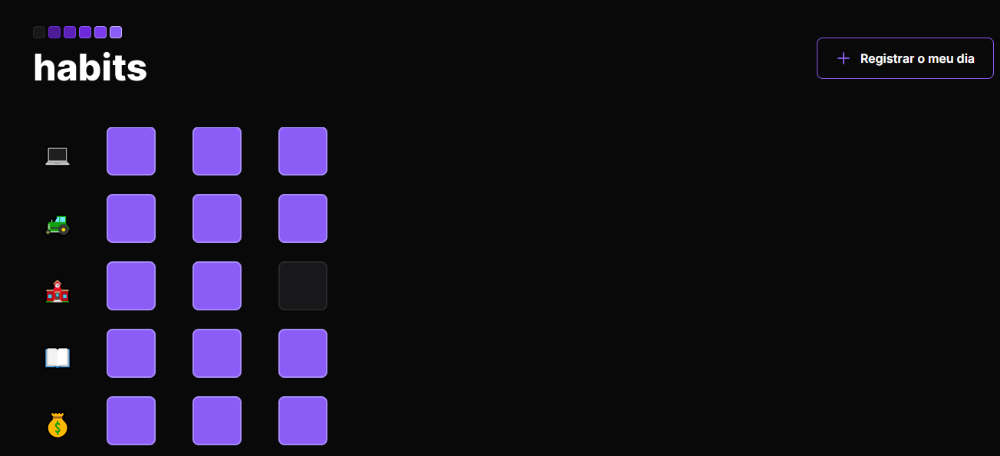

<h1 align="center"> Habits </h1>

Programa exclusivo e gratuito, promovido pela Rocketseat para ensino de tecnologias WEB.  
<a href="https://app.rocketseat.com.br/discover">Aprenda a programar do zero clicando aqui.</a>

 

  

## 🚀 Tecnologias

Esse projeto foi desenvolvido com as seguintes tecnologias:

- HTML e CSS
- JavaScript
- Git e Github

## 💻 Projeto

O Habists é um aplicativo marcador de habitos dia a dia.

- [Acesse o projeto finalizado, online](https://ricantony6.github.io/NLWSetup-Habits-/)

- ♥ aplicativo lançado pela Rocketseat
- ♥ Ricardo Antonio Rodrigues
